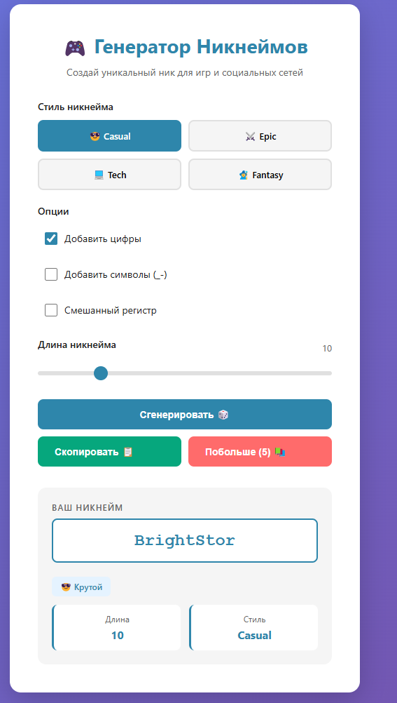

# Nicknamw_generator
#Когда пользователь нажимает кнопку "Сгенерировать", JavaScript отправляет POST-запрос на сервер с выбранными параметрами (стиль, длина, опции). Сервер Express получает запрос, маршрутизирует его в контроллер nicknameController.js, который выбирает случайный способ комбинирования слов из словаря выбранного стиля (Prefix+Word, Word+Suffix или Prefix+Word+Suffix). После генерации никнейма контроллер применяет дополнительные модификации (цифры, символы, смешанный регистр) и вычисляет оценку "крутости" на основе выбранного стиля, длины и количества добавленных элементов. Наконец, сервер отправляет JSON-ответ с никнеймом, его длиной, стилем и рейтингом, который отображается в браузере вместе с кнопками для копирования и пакетной генерации.

